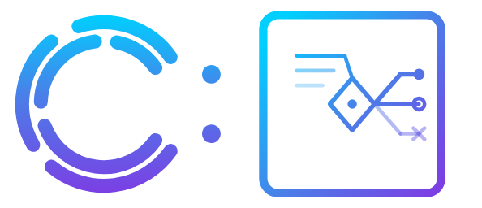

<p align="center">
  
</p>

<h4 align="center">LLM-powered issue triage. Built for builders.</h4>

<p align="center">
  <a href="https://clagentic.ai"></a>
  <a href="LICENSE"></a>
  
  <a href="https://ko-fi.com/clagentic"></a>
</p>

LLM-powered triage agent for GitHub issues and PRs. Part of the [clagentic](https://clagentic.ai) suite.

## What it does

clagentic:triage watches a GitHub org or repo for new issues and pull requests.
By default only **external contributors** are triaged — issues and PRs from the
operator's own org members, owners, and collaborators are filtered out, along with
any logins the operator chooses to ignore. This is configurable via
`source.watch_associations`, `source.ignore_logins`, and `source.watch_logins`
(see docs/CONFIG.md).
Each inbound event is enriched with repo context (a per-repo intent file plus
referenced documentation), then assessed by an LLM against the stated intent —
does this issue belong here, does this PR meet the bar, what action should follow?

The LLM returns a verdict and a suggested action. By default that suggestion waits
in a human-review queue. A human approves, overrides, or rejects it via the CLI.
Auto-approve can be enabled per action class once you trust the model's verdicts on
that class.

Approved actions execute through the source adapter (post comment, request changes,
close, approve PR) and optionally dispatch into a backend task system (Jira, Linear,
GitHub Issues, a webhook endpoint, or any custom dispatcher).

## Key properties

- **Human-in-the-loop by default.** Every verdict waits for approval unless you
  explicitly opt an action class into auto-approve. Confidence below the configured
  threshold always routes to HITL regardless of auto-approve settings.
- **Multi-runner LLM.** Four backends: `claude-cli` (default — spawns the `claude`
  CLI, requires OAuth session on the same host), `anthropic-api` (direct HTTP, no SDK,
  just an API key), `openai-compatible` (covers OpenAI, Azure OpenAI, Ollama,
  clagentic:router, and any OpenAI-compatible server — recommended for containerized or
  multi-host deployments), `clagentic-router` (legacy private protocol; prefer
  `openai-compatible` against a router instance). Model selection is config-driven,
  never hardcoded.
- **Pluggable source adapters.** Adapters normalize events from a platform (GitHub,
  GitLab, Forgejo, ...) into a common Event schema. The pipeline is adapter-agnostic.
- **Pluggable dispatch backends.** Dispatchers push verdicts into backend systems.
  Any backend — including private or internal tools — plugs in by module path. The
  core ships generic reference dispatchers (`webhook`, `noop`); concrete backends are
  external packages.
- **Post-verdict hooks.** Hooks fire after assessment, before the queue. The bundled
  `clagentic-console` hook opens a clagentic:console conversation on `escalate`
  verdicts. Additional hooks load by module path.
- **Zero runtime npm dependencies.** ESM, Node 20+, no bundler required.

## Install

Requires Node 20 or later.

Run from a clone:

```
git clone https://github.com/clagentic/clagentic-triage
cd clagentic-triage
node src/cli.js run
```

The binary is `clagentic-triage`.

## Quickstart

Create a minimal config file at `~/.config/clagentic/triage/config.json`:

```json
{
  "source": {
    "adapter": "github",
    "org": "your-org"
  },
  "runner": "claude-cli",
  "model": "claude-sonnet-4-5"
}
```

Set the required token:

```
export CLAGENTIC_TRIAGE_GITHUB_TOKEN=ghp_...
```

Run a single triage pass:

```
clagentic-triage run
```

Run a continuous poll loop:

```
clagentic-triage watch
```

Review the pending queue:

```
clagentic-triage review
```

Approve, override, or reject a queued verdict:

```
clagentic-triage approve <id>
clagentic-triage override <id> --action <class>
clagentic-triage reject <id>
```

`override` approves the item but substitutes a different action class
(`respond`, `request_changes`, `close`, `dispatch`, `escalate`, `approve`)
in place of the one the LLM suggested.

## Configuration

Configuration is loaded from environment variables (`CLAGENTIC_TRIAGE_*` prefix),
then `triage.config.json` in the working directory, then
`~/.config/clagentic/triage/config.json`.

See [docs/CONFIG.md](docs/CONFIG.md) for the full schema and all environment
variable overrides.

The two-tier pre-filter is optional and off by default. When enabled, a fast
cheap LLM pass classifies each inbound event as noise or real before the main
assessor runs, reducing cost on high-volume repos. Enable it by setting
`pre_filter.enabled: true` in the config file once you have a representative
event sample to tune against. See [docs/CONFIG.md#pre_filter](docs/CONFIG.md#pre_filter)
and DD-011 in [docs/DESIGN-DECISIONS.md](docs/DESIGN-DECISIONS.md).

## Security model

- **Webhook verification.** Inbound webhook deliveries are verified by the source
  adapter (HMAC-SHA256 for GitHub, token comparison for GitLab/Forgejo) before any
  payload parsing. The webhook secret is required at startup when the webhook server
  is enabled — an empty secret is rejected at config load time.
- **Prompt-injection boundary.** Issue and PR bodies are wrapped in
  `<UNTRUSTED_USER_CONTENT>` tags and pass through a redaction step before LLM
  prompt construction. Common secret patterns (`ghp_*`, `sk-*`, `AKIA*`,
  `-----BEGIN *`) are redacted to `[REDACTED]`.
- **Intent file trust boundary.** The per-repo intent file
  (`.github/triage-intent.yml`) is authored by repo maintainers with write access.
  Its content is injected into the prompt as operator-controlled configuration, not
  user input. Referenced context files are path-validated against an extension
  allowlist before fetching. Intent files are capped at 64 KB; referenced context
  files are capped per-file and in aggregate.
- **Secrets via env, never stored.** Tokens and API keys are read from environment
  variables named by `runner_api_key_env` (or the runner's default env var). They
  are never written to the config file or the pending queue.

See [docs/DESIGN-DECISIONS.md](docs/DESIGN-DECISIONS.md) for the full rationale
behind each security decision (DD-001 through DD-011).

## Documentation

| Document | Contents |
|---|---|
| [docs/ARCHITECTURE.md](docs/ARCHITECTURE.md) | Pipeline stages, module layout, interfaces |
| [docs/CONFIG.md](docs/CONFIG.md) | Full config schema and environment variable reference |
| [docs/GITHUB_APP.md](docs/GITHUB_APP.md) | GitHub integration: PAT vs GitHub App, setup, webhook ingress, reverse proxy |
| [docs/ADAPTERS.md](docs/ADAPTERS.md) | Source adapter interface (poll + webhook), how to write one |
| [docs/DISPATCHERS.md](docs/DISPATCHERS.md) | Dispatch backend interface, reference dispatchers, third-party plugins |
| [docs/SECURITY.md](docs/SECURITY.md) | Token security, input validation, PII and data residency |
| [docs/DESIGN-DECISIONS.md](docs/DESIGN-DECISIONS.md) | DD-001..DD-011 rationale and security decisions |
| [docs/INTENT_AUTHORING.md](docs/INTENT_AUTHORING.md) | How to write a `.github/triage-intent.yml` file for your repo |

## Support

If clagentic:triage is useful to you: [ko-fi.com/clagentic](https://ko-fi.com/clagentic)

## Disclaimer

Not affiliated with Anthropic or OpenAI. Claude is a trademark of Anthropic. Codex is a
trademark of OpenAI. Provided "as is" without warranty. Users are responsible for
complying with their AI provider's terms of service.

## License

[FSL-1.1-MIT](LICENSE) — Functional Source License 1.1, with MIT as the Change License.

Free for personal, internal-business, evaluation, research, and non-commercial use.
Not free for offering this tool (or a substantial fork) as a competing commercial product.
Each release auto-converts to MIT on its second anniversary.
